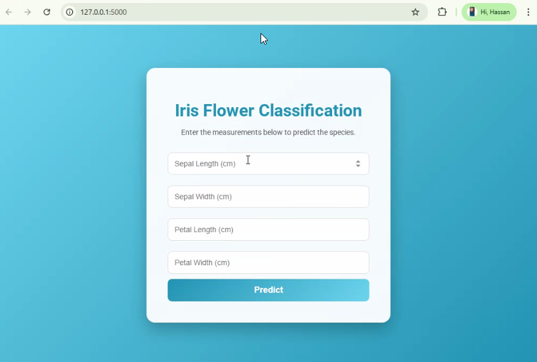

# Iris Flower Classification Web Application

A Machine Learning powered web application built using Flask that predicts the species of an Iris flower based on user input measurements.  
The application provides real-time predictions through an interactive and user-friendly web interface and displays the corresponding flower image.

---

## Project Overview

The Iris Web App allows users to input four flower measurements:

- Sepal Length  
- Sepal Width  
- Petal Length  
- Petal Width  

Based on these inputs, the trained machine learning model predicts the Iris species and displays the predicted species along with the corresponding flower image.  

---

## Features

- **Machine Learning Model Integration:** Predicts Iris species using a trained model  
- **Real-Time Prediction:** Instant predictions through Flask  
- **Responsive Web Interface:** Modern, clean, and professional UI  
- **Image Display:** Shows the corresponding flower image based on prediction  
- **Predict Again Functionality:** Users can make multiple predictions easily  
- **Ready for Deployment:** Clean architecture for production-ready use  

---

## Machine Learning Model

**Dataset:** Iris Dataset  

**Model:** Trained classifier saved as a pickle file (`model.pkl`)  

**Predicted Species:**  
- Setosa  
- Versicolor  
- Virginica  

**Why This Model:**  
- Works well with small tabular datasets  
- Fast predictions for real-time web apps  
- Simple and interpretable results  

---

## Project Structure

```bash
iris-webapp/
├── app.py
├── model.pkl
├── templates/
│   ├── index.html
│   └── result.html
├── static/
│   ├── style.css
│   └── images/
│       ├── setosa.jfif
│       ├── versicolor.jfif
│       └── virginica.jfif
└── README.md
```

---

## Installation Guide

1. Clone the repository:

```bash
git clone https://github.com/yourusername/iris-webapp.git
cd iris-webapp
```

2. Install required libraries:

```bash
pip install flask numpy scikit-learn
```

3. Run the Flask application:

```bash
python app.py
```

4. Open a browser at `http://127.0.0.1:5000` and start predicting.

---

## Technology Stack

  
  
  
  
  
  
  
  

---

## Use Cases

- Machine Learning deployment practice  
- Flask web development learning  
- Portfolio project for students and beginners  
- Demonstration of ML model integration  

---

## Future Improvements

- Add probability scores for predictions  
- Add charts and visualizations  
- Deploy on cloud platforms (AWS, Render, Heroku)  
- Improve UI with dashboard features  
- Multi-class or multi-dataset flower prediction  

---

## Author

Hassan Ali  
Aspiring Data Scientist and Machine learning Engineer

GitHub: https://github.com/Hassan-Ali786  

---

## Application Screenshot


